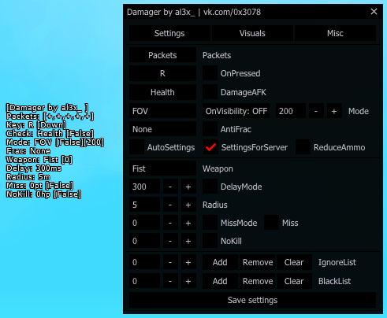

# Damager SA-MP 0.3.7 R1/R3-1
\
блестхак: https://www.blast.hk/threads/60774/
### Commands:
* /dmg - on/off
* /dmg pos - сменить позицию меню
* /dmg menu - открыть/закрыть imgui меню или F2 по умолчанию
* /dmg key value - сменить активацию, /dmg key - Pressed или Down
* /dmg check - проверка игрока по статусу или по хп
* /dmg afk - дамажить игроков в афк on/off
* /dmg mode value - 0 - по id, 1 - по хп, 2 - по дистанции, 3 - по пингу, 4 - по fov
* /dmg onv - дамажить только тех кто на экране on/off
* /dmg fov value - сменить fov для /dmg mode 4
* /dmg frac value - выбор фракции /dmg frac none - никого, /dmg frac all - по всем, /dmg frac value value2 value3 etc - по фракциям
* /dmg af - дамажить всех кроме выбранных фракций on/off
* /dmg as - автоматическая загрузка настроек on/off
* /dmg sfs - сохранение/загрузка настроек под текущий сервер on/off
* /dmg ra - уменьшение патрон on/off
* /dmg gun id - загрузка настроек / выбор с чего дамажить
* /dmg delay value value2 - задержка, /dmg delay value, /dmg delay value value2 - рандом от value до value2
* /dmg radius value - радиус
* /dmg miss value value2 - промахи, /dmg miss value, /dmg miss value value2 - рандом от value до value2, /dmg miss - on/off
* /dmg nokill value - не будет дамажить если хп игрока ниже указанного, /dmg nokill - on/off
* /dmg bl id - добавить в черный список, сначала дамажит черный список, а после фракцию
* /dmg dbl value - убрать из черного списка, /dmg dbl - убрать всех из черного списка
* /dmg ig id - добавить в игнор список
* /dmg dig value - убрать из игнор списка, /dmg dig - убрать всех из игнор списка

### Videos:

